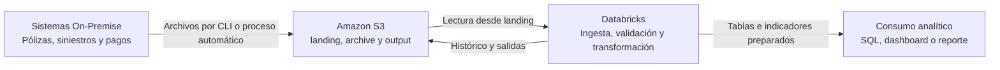

# M1-E06 — Guía del instructor

## Metadata

- Módulo: 1 — Fundamentos Cloud, AWS y Arquitectura Moderna de Datos
- Tema: Amazon S3, AWS CLI, arquitectura e IAM
- Tipo: `GUIDED`
- Duración estimada: 55 min
- Nivel: Fundamental
- Modalidad: `PRACTICO_CONDICIONAL`
- Requiere S3: Sí, con fallback
- Material asociado: `participante.md`

## Objetivo de la guía

Facilitar una primera experiencia real con S3 sin convertir la sesión en un
taller de administración de credenciales. El participante debe comprender que
Console, AWS CLI y los procesos automatizados son interfaces diferentes hacia
el mismo servicio.

## Decisión de diseño

### Modalidad recomendada

Cada participante crea un bucket de entrenamiento con nombre globalmente único
dentro de una cuenta sandbox autorizada.

Ventajas:

- evita que los participantes sobrescriban objetos ajenos
- permite observar la creación y configuración del bucket
- simplifica la asignación de evidencias individuales

### Modalidad con bucket compartido

Si el cliente no permite crear 31 buckets, el instructor prepara un único bucket
y asigna un prefijo aislado por participante:

```text
s3://<SHARED_BUCKET>/participantes/<PARTICIPANT_ID>/landing/
```

Esta modalidad requiere controles que impidan acceder a prefijos de otros
participantes. El estudiante omite `aws s3 mb` y comienza en la carga.

No se deben compartir credenciales entre participantes.

## Preparación previa del instructor

- Confirmar la cuenta sandbox y la región.
- Confirmar si se utilizarán buckets individuales o un bucket compartido.
- Probar CloudShell y los permisos al menos un día antes.
- Distribuir `datos-s3.zip`.
- Confirmar que ningún archivo contiene datos reales.
- Preparar la Opción B para participantes sin acceso.
- Definir quién realizará la limpieza posterior de objetos y buckets.

Permisos técnicos que deben validarse en el sandbox, ajustados al alcance real:

```text
cloudshell:PutCredentials
s3:CreateBucket                 # solo para modalidad individual
s3:ListBucket
s3:GetBucketPublicAccessBlock
s3:GetEncryptionConfiguration
s3:PutObject
s3:GetObject                    # solo si se validará descarga
```

El nombre exacto de algunas acciones para consultar configuración puede variar
según la policy y la herramienta utilizada. Probar el rol entregado antes de la
sesión y no ampliar permisos durante la clase.

## Distribución sugerida

| Momento | Duración | Acción del instructor |
| --- | ---: | --- |
| Contexto, identidad y seguridad | 10 min | Explicar el caso y confirmar cuenta, rol y región |
| Preparación de archivos | 5 min | Cargar y descomprimir el recurso |
| Nombre y creación | 10 min | Explicar unicidad y crear bucket |
| Seguridad del bucket | 5 min | Verificar acceso público y cifrado |
| `cp`, `sync` y `ls` | 10 min | Cargar y comprobar tres objetos |
| Comparación de métodos | 5 min | Contrastar Console, CLI y automatización |
| Arquitectura e IAM | 10 min | Cerrar con flujo y mínimo privilegio |

## Puntos de explicación

### Bucket y object key

- El bucket es el contenedor principal.
- Cada objeto se identifica mediante una key.
- `landing/polizas/polizas_2026_09_14.csv` es una object key.
- `landing/polizas/` es un prefijo, no una carpeta física tradicional.
- `archive/` y `output/` no aparecen hasta que exista algún objeto bajo esas keys.

### Nombre globalmente único

Reforzar que el nombre se comparte en el namespace de la partición AWS y no
debe incluir información sensible. Utilizar sufijos no predecibles y minúsculas.

### Métodos de carga

| Método | Uso apropiado en la actividad |
| --- | --- |
| Console | Carga exploratoria de pocos archivos |
| `aws s3 cp` | Copiar un archivo o ubicación conocida |
| `aws s3 sync` | Sincronizar una carpeta con un prefijo |
| Databricks/Lakeflow | Automatizar una ingesta recurrente y gobernada |

No presentar la carga manual como patrón productivo para archivos diarios.

## Solución de referencia

### Arquitectura



### Estructura objetivo

```text
s3://<S3_BUCKET>/
├── landing/
│   ├── polizas/
│   ├── siniestros/
│   └── pagos/
├── archive/
│   ├── polizas/
│   ├── siniestros/
│   └── pagos/
└── output/
    └── indicadores_operativos/
```

### Matriz de permisos

| Perfil | `landing/` | `archive/` | `output/` | Motivo |
| --- | --- | --- | --- | --- |
| `rol_ingesta_onprem` | Escritura | Sin acceso | Sin acceso | Solo deposita archivos |
| `rol_proceso_databricks` | Lectura | Lectura + escritura | Lectura + escritura | Procesa, conserva y publica |
| `rol_analista` | Sin acceso | Sin acceso | Lectura | Consulta resultados preparados |
| `rol_auditor` | Sin acceso | Lectura | Lectura | Revisa histórico y resultados |

Puede aceptarse que el proceso tenga solo escritura sobre `archive/` cuando el
reproceso no esté incluido. Todo permiso adicional debe justificarse.

### Equivalencia conceptual con IAM

| Necesidad | Acción IAM |
| --- | --- |
| Listar objetos | `s3:ListBucket`, limitado al prefijo requerido |
| Leer un objeto | `s3:GetObject` sobre el prefijo requerido |
| Escribir un objeto | `s3:PutObject` sobre el prefijo requerido |
| Eliminar un objeto | `s3:DeleteObject`, solo si existe esa responsabilidad |

Evitar `s3:*` y recursos globales por comodidad.

## Validaciones durante la ejecución

### Antes de crear

- la cuenta es la autorizada
- la identidad no es root
- la región es la indicada
- el nombre no contiene información sensible

### Después de crear

- el bucket existe en la región prevista
- el acceso público continúa bloqueado
- la consulta de cifrado responde correctamente

### Después de cargar

La salida recursiva debe contener tres object keys:

```text
landing/pagos/pagos_2026_09_14.csv
landing/polizas/polizas_2026_09_14.csv
landing/siniestros/siniestros_2026_09_14.json
```

No evaluar tamaños o timestamps exactos.

## Errores previstos y respuesta

| Error | Causa probable | Respuesta pedagógica |
| --- | --- | --- |
| `BucketAlreadyExists` | El nombre ya está ocupado | Cambiar el sufijo |
| `AccessDenied` en `mb` | El rol no crea buckets | Pasar a bucket compartido o fallback |
| `AccessDenied` en configuración | Permiso de consulta no habilitado | Mostrarlo como demo y continuar |
| `NoSuchBucket` | Variable vacía o nombre incorrecto | Imprimir y revisar las variables |
| `The user-provided path does not exist` | Directorio local incorrecto | Ubicarse junto a `datos/` |
| Solo aparece un objeto | No se ejecutó `sync` | Revisar fuente y destino |
| Objetos en la raíz | Destino sin prefijo | Corregir el destino de la carga |

## Seguridad

- No pedir Access Keys durante la sesión.
- Priorizar CloudShell o perfiles con credenciales temporales.
- No utilizar el usuario root.
- No hacer público el bucket.
- No cargar datos personales o corporativos.
- No mostrar `~/.aws/credentials`.
- No usar `aws s3 sync --delete`.
- No ampliar permisos para resolver un bloqueo en vivo.

## Limpieza posterior

La limpieza debe realizarla el propietario del sandbox conforme a las reglas del
entorno. No incluir comandos destructivos en la secuencia principal. Antes de
vaciar o eliminar un bucket, el instructor debe verificar el nombre exacto y
confirmar que pertenece a la capacitación.

## Criterios de logro

| Criterio | Logrado cuando |
| --- | --- |
| Entorno | Identifica cuenta, rol y región sin exponer secretos |
| S3 | Crea el bucket o comprende el flujo equivalente |
| Carga | Distingue `cp` y `sync` y obtiene tres object keys |
| Organización | Explica bucket, key y prefijo correctamente |
| Arquitectura | Ubica S3 entre la fuente y Databricks |
| Seguridad | Asigna permisos mínimos por perfil |
| Transferencia | Distingue carga manual de ingesta productiva |

## Aplicación en el trabajo diario

Relacionar el ejercicio con la recepción de archivos, la revisión de cargas, la
automatización posterior desde Databricks y la solicitud de accesos acotados por
prefijo y responsabilidad.

## Referencias oficiales

- [Primeros pasos con Amazon S3 mediante AWS CLI](https://docs.aws.amazon.com/AmazonS3/latest/userguide/GettingStartedS3CLI.html)
- [Comandos `cp`, `sync` y `ls`](https://docs.aws.amazon.com/cli/latest/userguide/cli-services-s3-commands.html)
- [Reglas y unicidad de nombres de buckets](https://docs.aws.amazon.com/AmazonS3/latest/userguide/bucketnamingrules.html)
- [CloudShell y autenticación de AWS CLI](https://docs.aws.amazon.com/cloudshell/latest/userguide/welcome.html)
- [Autenticación de AWS CLI con IAM Identity Center](https://docs.aws.amazon.com/cli/latest/userguide/cli-configure-sso.html)
