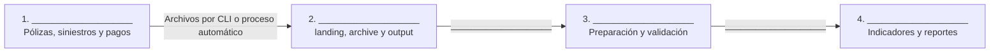

# M1-E06 — Crear y organizar un bucket S3 con AWS CLI

## Metadata

- Módulo: 1 — Fundamentos Cloud, AWS y Arquitectura Moderna de Datos
- Tema: Amazon S3, AWS CLI, arquitectura e IAM
- Tipo: `GUIDED`
- Duración estimada: 55 min
- Nivel: Fundamental
- Modalidad: `PRACTICO_CONDICIONAL`
- Requiere S3: Sí, con fallback
- Requiere GitHub: No; los archivos también pueden descargarse previamente
- Dataset: pólizas, siniestros y pagos sintéticos
- Conceptos previos: On-Premise, Cloud y responsabilidad compartida

## Contexto de negocio

`aseguradora_demo` recibe archivos diarios de pólizas, siniestros y pagos desde
sistemas On-Premise. Para evitar envíos por correo y copias descontroladas,
utilizará un bucket Amazon S3 como punto de entrada central. Databricks leerá
posteriormente esos objetos para preparar información analítica.

En esta actividad crearás un bucket de entrenamiento con nombre globalmente
único y cargarás los archivos mediante AWS CLI. Después relacionarás lo ejecutado
con la arquitectura y los permisos mínimos que necesitaría cada perfil.

El escenario y los datos son completamente ficticios.

## Objetivo de aprendizaje

Comprender S3 mediante una experiencia real de creación, carga y verificación,
comparando distintas formas de interactuar con el servicio y evitando el uso de
credenciales inseguras.

## Qué aprenderás

- por qué el nombre de un bucket debe ser globalmente único
- cómo crear un bucket desde AWS CLI
- cómo cargar un archivo con `aws s3 cp`
- cómo cargar una estructura de directorios con `aws s3 sync`
- cómo los object keys forman prefijos como `landing/polizas/`
- cómo verificar objetos con la consola y con `aws s3 ls`
- qué permisos mínimos requiere cada participante del flujo
- cómo se conecta S3 con Databricks y el consumo analítico

## Requisitos previos

### Opción recomendada — AWS CloudShell

- Acceso autorizado a una cuenta académica o sandbox de AWS.
- Acceso a AWS Management Console y CloudShell.
- Permisos limitados para crear un bucket de entrenamiento, consultar su
  configuración y cargar/listar objetos.
- Archivo `datos-s3.zip` proporcionado por el instructor.

CloudShell ya incluye AWS CLI y utiliza la sesión autenticada de la consola. No
debes ejecutar `aws configure` ni copiar Access Keys.

### Opción local — AWS CLI

- AWS CLI v2 instalado.
- Perfil académico o corporativo previamente configurado con credenciales
  temporales, por ejemplo `<AWS_PROFILE>`.
- Copia local de la carpeta `datos/` de esta actividad.

No pegues `AWS Access Key`, `AWS Secret Access Key` o Session Tokens en el
notebook, terminal compartida, chat, captura o repositorio.

## Dataset

```text
datos/
└── landing/
    ├── polizas/
    │   └── polizas_2026_09_14.csv
    ├── siniestros/
    │   └── siniestros_2026_09_14.json
    └── pagos/
        └── pagos_2026_09_14.csv
```

Los datos son pequeños y sintéticos. No contienen información personal real.

## Escenario

El bucket debe cumplir las siguientes reglas:

1. Su nombre no debe contener información sensible.
2. Debe crearse en la región indicada por el instructor.
3. El acceso público debe permanecer bloqueado.
4. Los objetos se organizarán por entidad dentro de `landing/`.
5. `archive/` y `output/` se diseñarán ahora, pero aparecerán cuando un proceso
   escriba objetos en esas zonas.
6. Cada perfil tendrá únicamente los permisos necesarios.

## Opción A — práctica principal con AWS CLI

### Actividad 1 — Comprender el caso y preparar el entorno — 10 min

Abre AWS CloudShell o una terminal con el perfil autorizado. Verifica la versión
de AWS CLI:

```bash
aws --version
```

Comprueba con qué identidad y cuenta estás trabajando:

```bash
aws sts get-caller-identity
```

Valida antes de continuar:

- [ ] La cuenta corresponde al sandbox de capacitación.
- [ ] La identidad no es el usuario root.
- [ ] La región fue confirmada por el instructor.
- [ ] No se mostraron ni copiaron secretos.

### Actividad 2 — Preparar los archivos — 5 min

#### En CloudShell

1. Descarga `datos-s3.zip` desde los recursos del curso.
2. En CloudShell, selecciona **Actions → Upload file**.
3. Carga `datos-s3.zip`.
4. Descomprime el archivo:

```bash
unzip datos-s3.zip
```

5. Comprueba la estructura:

```bash
find datos -type f
```

#### En una terminal local

Ubícate en la carpeta de esta actividad y comprueba la estructura:

```bash
find datos -type f
```

### Actividad 3 — Definir un nombre único — 5 min

Completa los placeholders sin utilizar nombres de personas, correos, DNI,
números de póliza ni otra información sensible:

```text
Región: <AWS_REGION>
Bucket: seguros-training-<PARTICIPANT_ID>-<UNIQUE_SUFFIX>
```

Ejemplo de formato, no reutilizable literalmente:

```text
seguros-training-p07-a9f4c2
```

Reglas de esta actividad:

- utilizar solo minúsculas, números y guiones
- comenzar y terminar con letra o número
- evitar puntos para simplificar el acceso HTTPS
- añadir un sufijo aleatorio para reducir colisiones
- mantener el nombre por debajo de 63 caracteres

Define variables para no repetir valores. Reemplaza primero los placeholders:

```bash
export TRAINING_AWS_REGION="<AWS_REGION>"
export TRAINING_S3_BUCKET="<S3_BUCKET>"
```

Muestra los valores y confirma que no estén vacíos:

```bash
printf 'Region: %s\nBucket: %s\n' "$TRAINING_AWS_REGION" "$TRAINING_S3_BUCKET"
```

### Actividad 4 — Crear el bucket — 5 min

```bash
aws s3 mb "s3://$TRAINING_S3_BUCKET" --region "$TRAINING_AWS_REGION"
```

Resultado esperado:

```text
make_bucket: <S3_BUCKET>
```

Si aparece `BucketAlreadyExists`, cambia únicamente `<UNIQUE_SUFFIX>` y vuelve a
intentarlo. Si aparece `AccessDenied`, utiliza la Opción B; no intentes ampliar
tus propios permisos.

### Actividad 5 — Confirmar la protección del bucket — 5 min

Comprueba el bloqueo de acceso público:

```bash
aws s3api get-public-access-block --bucket "$TRAINING_S3_BUCKET"
```

Comprueba la configuración de cifrado:

```bash
aws s3api get-bucket-encryption --bucket "$TRAINING_S3_BUCKET"
```

No modifiques estas configuraciones salvo indicación explícita del instructor.

### Actividad 6 — Cargar un archivo con `cp` — 5 min

Carga únicamente el archivo de pólizas:

```bash
aws s3 cp \
  datos/landing/polizas/polizas_2026_09_14.csv \
  "s3://$TRAINING_S3_BUCKET/landing/polizas/"
```

Verifica el prefijo:

```bash
aws s3 ls "s3://$TRAINING_S3_BUCKET/landing/polizas/"
```

### Actividad 7 — Cargar la estructura con `sync` — 5 min

Sincroniza la carpeta completa. El archivo de pólizas ya existente no debería
necesitar una nueva transferencia si no cambió:

```bash
aws s3 sync datos/landing "s3://$TRAINING_S3_BUCKET/landing/"
```

Verifica todos los objetos:

```bash
aws s3 ls "s3://$TRAINING_S3_BUCKET/landing/" --recursive
```

Debes encontrar exactamente tres archivos dentro de los prefijos de pólizas,
siniestros y pagos.

### Actividad 8 — Comparar formas de carga — 5 min

Completa la tabla:

| Alternativa | ¿Qué hicimos o vimos? | ¿Cuándo la utilizarías? |
| --- | --- | --- |
| AWS Console | | |
| `aws s3 cp` | | |
| `aws s3 sync` | | |
| Proceso automatizado desde Databricks | | |

Responde:

1. ¿Qué alternativa es más clara para cargar un único archivo manualmente?
2. ¿Qué alternativa ayuda a repetir la carga de una carpeta?
3. ¿Cuál evitarías para un proceso productivo recurrente y por qué?

### Actividad 9 — Completar arquitectura y permisos — 10 min

Completa el diagrama:



Diseña la estructura objetivo:

```text
s3://<S3_BUCKET>/
├── landing/
│   ├── polizas/
│   ├── siniestros/
│   └── pagos/
├── archive/
│   ├── polizas/
│   ├── siniestros/
│   └── pagos/
└── output/
    └── indicadores_operativos/
```

Asigna `LECTURA`, `ESCRITURA`, `LECTURA + ESCRITURA` o `SIN ACCESO`:

| Perfil | `landing/` | `archive/` | `output/` | Justificación |
| --- | --- | --- | --- | --- |
| `rol_ingesta_onprem` | | | | |
| `rol_proceso_databricks` | | | | |
| `rol_analista` | | | | |
| `rol_auditor` | | | | |

## Evidencia de la práctica

Entrega una captura o archivo de texto que muestre:

1. La identidad utilizada, ocultando cualquier dato que no deba compartirse.
2. El nombre y región del bucket.
3. La salida de `aws s3 ls ... --recursive` con tres objetos.
4. La tabla comparativa de formas de carga.
5. El diagrama y la matriz de permisos completados.

No incluyas secretos ni contenido de archivos de configuración de AWS.

## Opción B — fallback sin permiso para crear buckets

Si no tienes acceso a AWS, realiza estas actividades:

1. Utiliza el nombre ficticio `s3://<S3_BUCKET>/`.
2. Lee los comandos de la Opción A e indica qué resultado produciría cada uno.
3. Construye localmente la estructura `datos/landing/` entregada.
4. Completa la comparación entre Console, `cp`, `sync` y carga automatizada.
5. Completa el diagrama y la matriz de permisos.
6. Analiza la salida simulada incluida en `salida-esperada-cli.txt`.

Si el instructor dispone de un bucket compartido, utilizará un prefijo aislado:

```text
s3://<SHARED_BUCKET>/participantes/<PARTICIPANT_ID>/landing/
```

En ese caso no intentes crear otro bucket ni acceder al prefijo de un compañero.

## Qué cambia en producción

- La creación y configuración de buckets suele automatizarse y aprobarse.
- Los procesos utilizan roles y credenciales temporales, no Access Keys embebidas.
- Los permisos se limitan por bucket y prefijo.
- El cifrado, logging, retención y clasificación siguen políticas corporativas.
- Databricks accede mediante mecanismos gobernados definidos por la organización.
- La carga recurrente se implementa como ingesta o pipeline, no como pasos manuales.

## Resultado esperado

Al finalizar debes contar con:

- un bucket de entrenamiento con nombre único o una evidencia simulada
- tres objetos correctamente organizados bajo `landing/`
- una comparación de cuatro formas de carga
- un diagrama On-Premise → S3 → Databricks → consumo analítico
- una matriz de mínimo privilegio por perfil

## Validación

- [ ] Trabajé en la cuenta y región indicadas.
- [ ] No utilicé el usuario root.
- [ ] No copié ni compartí credenciales.
- [ ] El bucket no contiene información sensible en su nombre.
- [ ] El acceso público permanece bloqueado.
- [ ] Los tres archivos aparecen en su prefijo correspondiente.
- [ ] Puedo explicar la diferencia entre `cp` y `sync`.
- [ ] El consumidor utiliza resultados preparados y no archivos raw.
- [ ] Ningún perfil recibe permisos totales sin justificación.

## Aplicación en el trabajo diario

La actividad permite reconocer cómo llegan los archivos a object storage,
interpretar cargas manuales y automatizadas, validar una estructura S3 y
solicitar permisos con un alcance claro antes de conectar Databricks.

## Extensión opcional

Ejecuta nuevamente `sync` sin modificar archivos y observa el resultado. Después
agrega localmente un archivo incremental ficticio y predice qué objeto nuevo se
cargaría. No utilices `--delete` en esta actividad.

## Referencias oficiales

- [Primeros pasos con Amazon S3 mediante AWS CLI](https://docs.aws.amazon.com/AmazonS3/latest/userguide/GettingStartedS3CLI.html)
- [Comandos de alto nivel de S3 en AWS CLI](https://docs.aws.amazon.com/cli/latest/userguide/cli-services-s3-commands.html)
- [Reglas para nombres de buckets](https://docs.aws.amazon.com/AmazonS3/latest/userguide/bucketnamingrules.html)
- [AWS CloudShell](https://docs.aws.amazon.com/cloudshell/latest/userguide/welcome.html)
